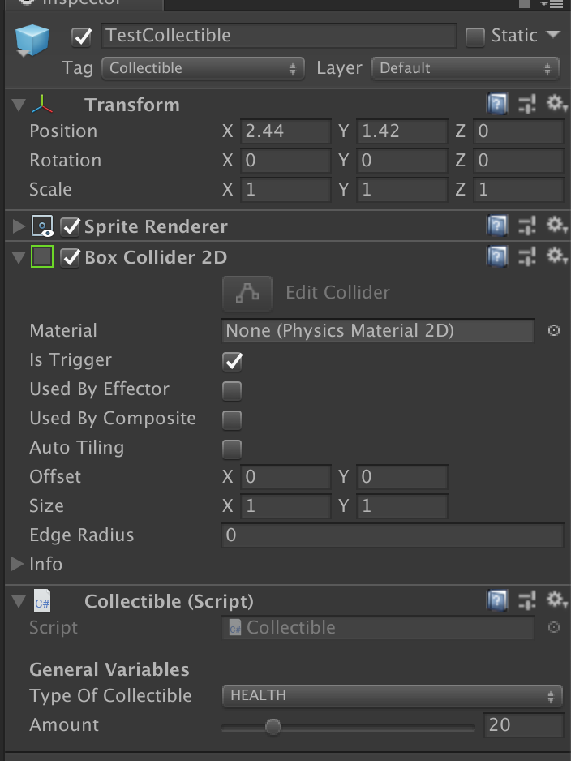

# Collectibles Prefab

The documentation goes over how to configure collectibles in the game.

### Summary
When the player collides with this GameObject, they will receive a positive bonus, based on the type of collectible they collected.

### Collectible Component
This script changes its functionality depending on the type of collectible that is set.
- `Type of Collectible`: Can toggle between `HEALTH` or `LIVES`
- `Amount`: How much of a bonus the player receives. If `Type of Collectible` is `LIVES`, the value for this is clamped to just 1.

### How to add more Collectible Types
1. Go into the `Collectible` script and add another `CollectibleType` enum.
2. In the `CollectCollectible` method, simply add another `case` that corresponds to the new `CollectibleType`.
