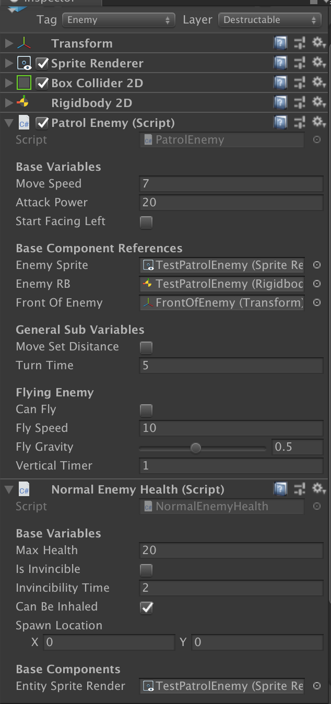

# Enemy Documentation
This documentation covers how enemies in the prototype behave and configuring their components.

### Summary

Every enemy is tagged `Enemy` and on the layer `Destructible`.
All enemies share the following components:
- `Sprite Renderer`
- `Box Collider 2D`
- `Rigidbody 2D`
> Each of these are configured differently depending on the type of enemy. Please refer to the future sections in seeing examples of how to set such components.

Also, all enemies have the following hierarchy in their prefab:

#### Unique Components
In the prototype, all enemies have the following components
- `Patrol Enemy`
- `Normal Enemy Health`

##### Patrol Enemy component
This is the main mechanism that controls how the enemy moves around in the world.
- `Move Speed`: Determines how fast the enemy moves around.
- `Attack Power`: How much damage does this enemy do when colliding with the player
- `Start Facing Left`: By default, the enemy will move to the right. When toggled, this forces the enemy to move left instad. This MUST be toggled at the start of the enemy's creation. It will _**not work**_ when the game has already been started.
- `Can Be Inhaled`: Can this enemy be inhaled by the player?
- `Move Set Distance`: By default, the enemy will continuously move in one direction until it hits a wall or another enemy, then it will change direction. When toggled, the enemy will move in one direction for `turnTime` seconds before automatically turning around.
- `Turn Time`: This works in cotangent with `Move Set Distance` in that this is the number of seconds it takes for the enemy to turn around. If `Move Set Distance` is off, this does nothing.
- `Can Fly`: By default, enemies cannot move upwards. When toggled on, this allows for the enemy to move upwards as well as side to side.
- `Fly Speed`: The speed in which the enemy moves when airborn, as indicated by `Can Fly`.
- `Fly Gravity`: How fast does the enemy fall while in the air?
- `Vertical Timer`: How long can the enemy move upwards before falling back down?

#### Normal Enemy Health component
This indicates how much health the enemy has. This also handles the mechanisms for removing and respawning enemies. In this prototype, only two of the `Base Variables` are used (since this inherits from `BaseHealth`)
- `Can Be Inhaled`: Determines if this enemy can be inhaled by the player. Defaulted to be true.
- `Max Health`: The starting health the enemy has. This also limits the max amount of health an enemy has.
- `Spawn Location`: The starting location of the enemy. When the enemy respawns, it will spawn from this location.

## Types of Enemies
In the prototype, there are only three different types of enemies, saved as three different prefabs:

#### Still Enemy
This enemy, pictured earlier, is the most basic enemy. It does not move at all, but will damage the player when the player runs into it.

#### Patrol Enemy

- This enemy moves around on the ground. By default, moves in one direction until it hits a wall or another enemy. Then it turns around and continuously moves in that direction. Can be toggled to automatically change direction after `Turn Time Seconds`

#### Flying Enemy

- Similar to the Patrol Enemy, but this enemy has `Can Fly` toggled. This enemy moves up and down along side to side in the air. Like Patrol Enemy, the side to side movement can be toggled to occur more frequently.
