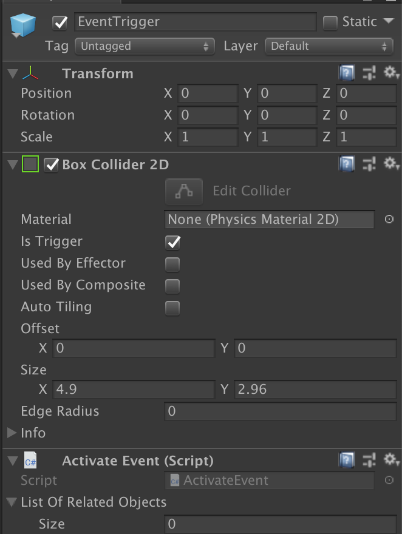
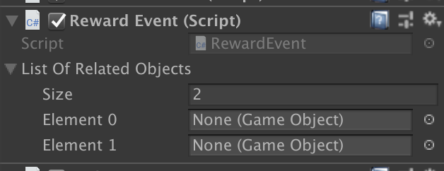

# Events and Rewards
This documentation covers how to utilize the `Activate Event` and `Reward Event` components.

## `Activate Event` Component

- This activates existing GameObjects that are associated with the `Activate Event` component.
  - There needs to be a `Collider` hitbox that has `isTrigger` component checked on it.
  - Only the player can activate this event.
- To activate this, the player needs to collide into the hitbox that is defined here.
- Once the event is activated, it cannot be activate again, unless you run `ResetEvent` in the script.

## `Reward Event` Component

- This one is similar in functionality to `Activate Event` in that this also activates an existing GameObject in the Scene. However:
  - This component is attached to an existing GameObject that has a `BaseHealth` script to it (for now)
  - To activate this, the GameObject this script is attached to must lose all of its health.
- Once the event is activated, it cannot be activate again, unless you run `ResetEvent` in the script.
  - In this case, the GameObject with the `BaseHealth` script will also need to have its health restored too.
