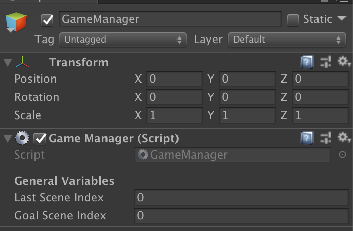

# Game Manager Documentation
This documentation handles how the GameManager works in this prototype.

## Summary
This unique object stores and executes functions that are related to the game process. Due to this behavior, **only one of these exists at all times**.

Some of the functions that this script does includes
- Keeping track of all enemies and blocks in the level.
- Respawning all of the enemies and blocks in the level.
- Keeping track of the last scene the player was on.
- Takes the player to the GoalScene or GameOver screen
- Pauses/Resumes the entire game

#### Variables
- `Last Scene Index`: The last scene the player was in. Used in restarting a level that the player Game Over-ed in
- `Goal Scene Index`: Keeps track of the scene number in the build that leads to the Goal scene.
