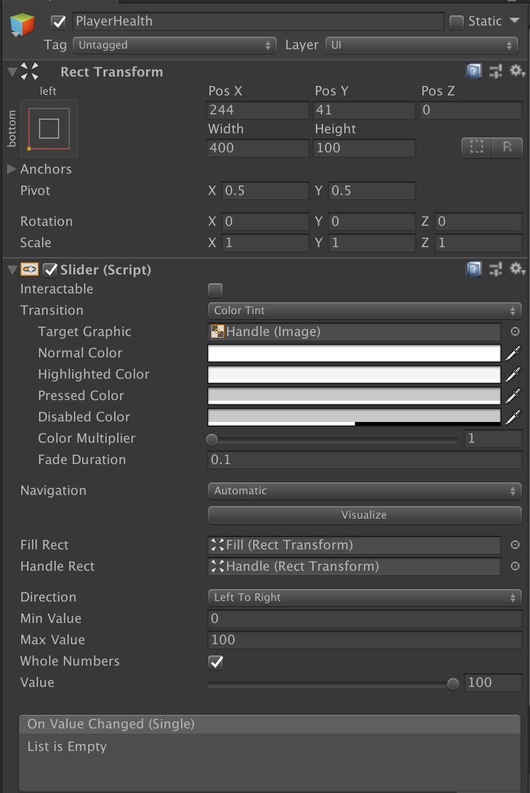

# User Interface Documentation
This documentation serves to highlight the main gameplay UI in the prototype.

Currently, in the prototype, there are two main objects that are shown to the player at all times:
- The Life Counter
- Player Health

## Summary

The main UI consists of the following items:
- `Event System`: Built in GameObject that is used with the UI.
- `Life Counter`: Showcases the player's lives
- `Player Health`: Displays the current amount of health the player has.

The UI object itself is fairly straightforward with one small exception.

- In the `Canvas Scaler`, the UI is scaled properly so that it can fit dynamically on any screen that is 16:9 ratio.

## Life Counter

- This UI showcases how many extra tries the player has. If this reaches below 1, the player loses the prototype.

#### Details

- Above is the `Inspector` for the image that is next to the number of lives. To change the image used, simply change the source image to something else.

- The counter uses TextMesh Pro, configured to be along the following. Note that in order to make the `x` in the counter smaller than the number, we need to toggle `SC` mode.

- This showcases how to make the text have an outline on it.

## Player Health

This UI visually represents how many hit points the player has before dying and losing a life. To gauge how much health a player has, refer to the amount of `red` there is in the gauge.

- This is the hierarchy of the health bar UI, which as of now, is just a slightly modified `Slider` UI component. Note that the handle to mode the slider is missing as well as the slider's `red` gauge is filled all the way.

- The GameObject with the `Slider` component is the GameObject with the most changes, notably, with the `intractability` turned off and the `Whole Numbers` boolean checked. We also made `100` to be the max value and started the value off to be `100`.
