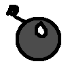
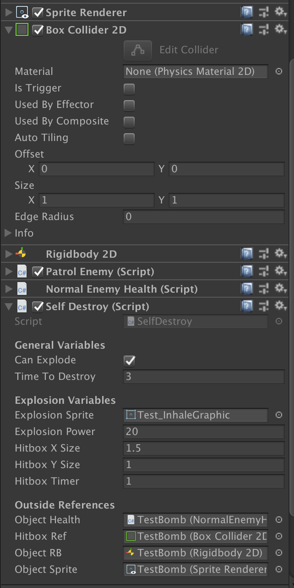

# Hazards
This documentation goes over what are the various objects that can harm the player, but are not necessarily mobile enemies.

## Bombs

- This is an unique GameObject in that it is spawnd only from the `BombMiniBoss` that is currently in the prototype.
- These have a special behavior:
  - They cannot move normally. However, when the boss spawns these, they move in a diagonal, manner.
  - After X seconds, these will explode, creating a damaging hitbox that can harm the player if they are caught in it.
  - The player CAN inhale these in and spit them out.

### Defining Traits

- This hazard shares the exact same components as a normal enemy, but with the key differences:
  - The bomb has a `move speed = 0` in the `Patrol Enemy` script. Everything else is left to the default settings.
  - The bomb has a new component, `Self Destroy`

#### `Self Destroy` Component
When attached to an entity, can now have the option to be removed after X seconds, defined by `TimeToDestroy`.
  - If `Can Explode` is true, the object, when destroyed, will leave behind a damaging hitbox that can only hurt the player.
    - When toggled, this allows for all of the `Explosion Variables` to be utilized.
    - If `CanExplode` is false, all of the `Explosion Variables` are ignored.
- `Explosion Power`: How much damage does the explosion do when the player collides with it?
- `Hitbox X/Y Size`: How big is the hitbox for the explosion?
- `HitBox Timer`: How long does the explosion last?
