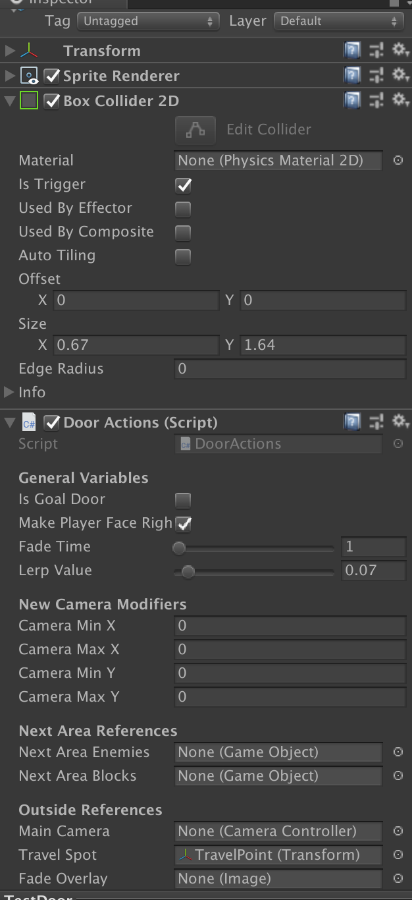

# Level Terrain Documentation
This documentation covers the various level geometry that the player can interact.

## Ground Floors
There are two types of grounded floors in the prototype: `Normal Ground` and `Slopes`

- `Normal Ground`: This is a GameObject that is tagged `Ground` and on the `Indestructible` layer. The player can land and move on this, but cannot move through it.

- `Slopes`: This is a GameObject that is also tagged `Ground` and layered on `Indestructible`. However, the player's movement changes depending on how they are moving on said slope.

> Note: Slopes also use a different type of collider (`Polygon Collider 2D`) in order to accommodate for its different shape.

## Blocks
These are like the grounded floors, with their main difference being labeled `Block` and on the layer `Destructible`.

#### Behavior
Unlike other ground objects, these can be destroyed by the player by either sliding into them, inhaling them, shooting a star or airpuff at them.

- Each block has a component called `BlockHealth` that is used to dictate how much health a block has before breaking. This works the same as an entity.

## Platforms

These objects are special in that they allow for any entity to pass through them if they jumped directly underneath them.

#### Behavior

By default, these platforms are tagged `PassBothGround` and on the layer `Indestructible`.
- `PassBothGround`: When tagged this, the player can pass through the platform from above if they are ducking.
- `PassGround`: When tagged this, the player cannot pass through this platform from above, even if they are ducking.

These also have a `Platform Effector 2D`, which handles all of the logic when it comes to performing the pass through.

## Doors

These are special objects in each level that teleport the player to another point in the level.

#### How To Use
1. Move the `TravelPoint` GameObject that is attached to the door somewhere in the Scene.
2. In the `DoorActions` Component, configure if the door is either a`Goal Door` and whether or not the player is facing right when leaving said door.
3. Configure the new bounds the camera will have to use when following the player at the new location.
4. To use the door, the player must be touching it and hitting the `W` key. If the screen fades to black and back out, the door works!

#### More information on Components
- `Door Actions`: This handles all of the logic that the door uses when teleporting the player
  - `IsGoalDoor`: When checked, _none_ of the `Camera Modifiers` variables have to be configured OR move the TravelPoint. By entering this door, the player is taken to the `ResultScreen`
  - `MakePlayerFaceRight`: Toggles whether the player should be facing right or left when emerging from the door.
  - `FadeTime`: How long is the transition?
  - `LerpValue`: How fast is the fade to black?
  - `Camera Min/Max X and Y`: These variables are directly fed into the `CameraController` of the Main Camera. These dynamically adjust the position of the camera in order to follow the player in their new position.
