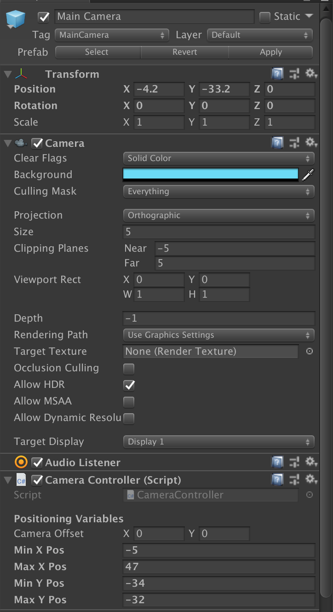

# Main Camera Prefab

## Summary
This GameObject handles how the player sees the gameplay. This specific `MainCamera` is only used during the `Prototype` scene.

## Camera Controller Component
This dictates how the `MainCamera` will follow the player at all times during the game.

#### References
This component is used in the `DoorActions` script in that when the player enters a door, the camera `Min/Max X and Y` positions are dynamically changed so the camera could properly follow the player. 

#### Specific Variables
- `Min/Max X and Y Pos`: Specific X/Y coords tell the camera to _not_ move past those specific points
- `Camera Offset`: Repositions the camera around the player so that the camera isn't always centered around the player.
