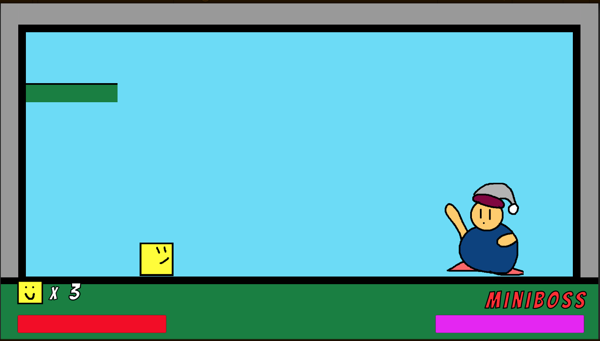
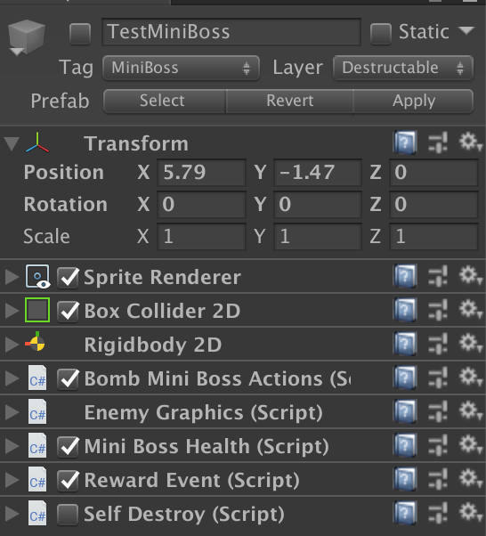
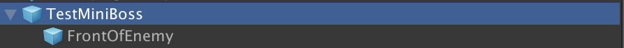
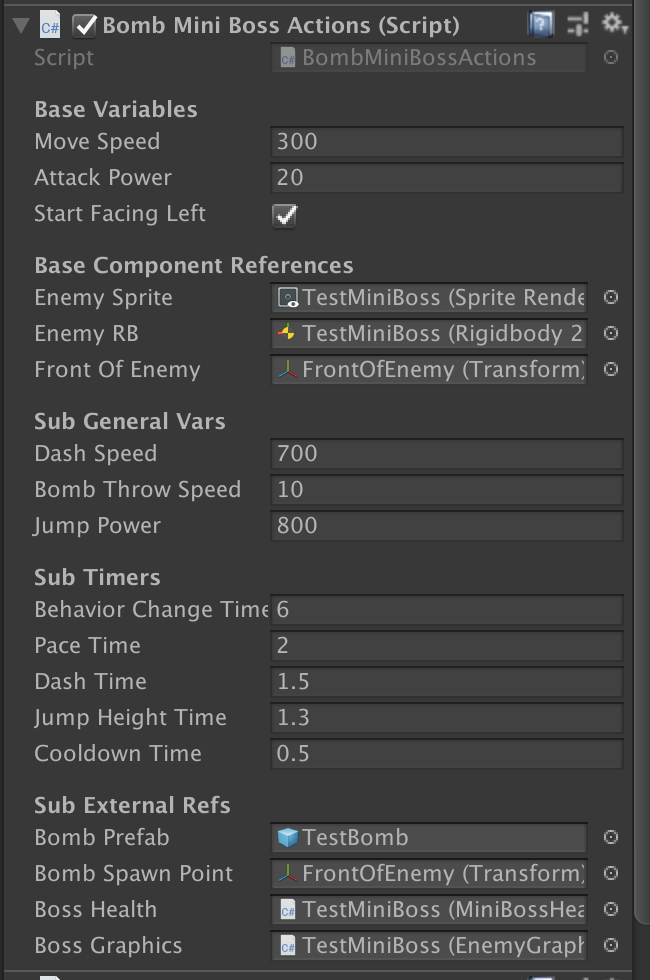
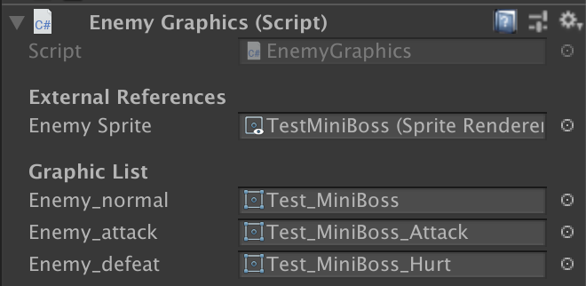
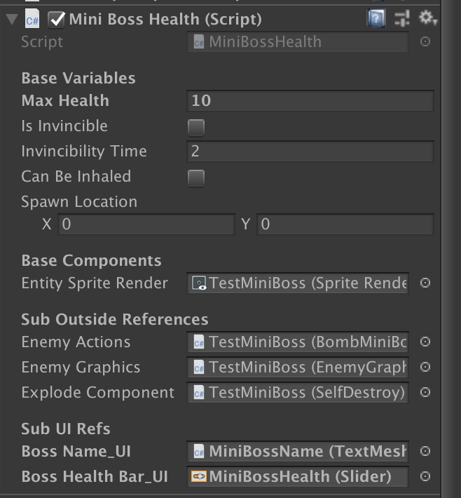

# MiniBoss AI Documentation
This documentation goes into depth of how the prototype Miniboss functions.

## Summary

- When the player encounters a MiniBoss:
  - A new HUD will appear on the bottom right hand of the screen that depicts the name of the boss and its health bar.
- The player generally needs to defeat the miniboss in order to proceed.

## How to Use
- The MiniBoss should be in its own room, in order to make sure the camera can stay focused on it.
- By default, the Miniboss should be deactivated as well as its HUD.
- Can associate the miniboss to activate by either using a `Door` transition, or a `Activate Event` trigger.
- To associate progression, like proceeding through a door, attach `Reward Event` to the MiniBoss and associate said door to the event.

## MiniBoss Prefab

- This image depicts what goes into a MiniBoss. Like a normal enemy, these have:
  - `Sprite Renderer`
  - `Box Collider 2D`
  - `RigidBody 2D`

- Like all enemies, this also has a GameObject that represents its front.

### Unique Components
Minibosses have the following new changes to them:
- `Boss Actions`
- `Enemy Graphics`
- `MiniBoss Health`
- `Self Destroy`

> Note that `Self Destroy` in the example image is disabled at the start. This is so to prevent the miniboss from dying early.

#### `Boss Actions` Component

- This is generally associated with how the boss will behave. In the prototype, there is only one boss actions script, `BombMiniBossActons`
 ##### Summary
 - This miniboss has three unique behaviors:
   - **Paces** (State 1)
     - Tne boss will move slowly back and forth.
   - **Dashes** (State 2)
     - The boss charges forward for a small bit before stopping and turning around.
   - **Jump Bomb** Throw (State 3)
     - The boss jumps upwards and tosses a `Bomb` at the peak of its jump.
 - The boss will start off in state 1. From there, it will _randomly_ choose to do either state 2 or 3.
 - Once it does either state 2 or 3, it will go back to state 1 and repeat the cycle.
 - The player will take damage if it is touching the miniboss during any of its phases
 - When it runs out of HP, the boss will stop moving. After a few seconds, the boss will explode, damaging the player if they are nearby.
   - The player can inhale the boss in anytime while it is defeated. __(normally, the player cannot inhale the boss)__

 #### How To Win
 - The miniboss can only be damaged by spitting out `star projectiles` back at it. The only way to do this normally is to inhale the bombs the boss throws and spit them back.
 - The boss takes three hits before going down.

 #### Unique Variables
 - `Dash Speed`: How fast does the boss move when it is in state 2? Tied to the boss's rigidbody `mass`
 - `Bomb Throw Speed`: How fast does the bomb move when the boss throws it? Tied to the bomb's rigidbody `mass`
 - `Jump Power`: How fast does the miniboss jump when it is performing state 3? Tied to the boss's rigidbody `mass`
 - `Behavior Change Time`: How much time is in between the boss's actions while it is in state 1?
 - `Pace Time`: How long does it take to have the miniboss move in the opposite direction while in state 1?
 - `Dash Time`: How long does the miniboss's dash last?
 - `Jump Height Time`: How long does the miniboss jump?
 - `Cooldown Time`: How much time is required to pass after the miniboss performs either state 2 or state 3?
 - `Bomb Prefab`: Link to the bomb prefab the miniboss spawns when it is in state 3.
 - `Bomb Spawn Point`: This should be the `FrontOfEnemy` gameobject, since this is where the bomb will be placed after being spawned.

#### `Enemy Graphics Component`

- This component handles changing the miniboss's looks while it is moving. This is identical to how `Player Graphics` works, except this one has less sprites to use.
  - In the future, all enemies will have something like this in order to change between sprites.

#### `MiniBoss Health Component`

- This is identical to the `NormalEnemyHealth` component in that it keeps track of the miniboss's health. The few changes are:
  - `CanBeInhaled` is toggled **off**. Until the miniboss is defeated, the player cannot inhale thie entity.
  - Has a reference to the `SelfDestroy` component attached to this GameObject, which will become active when the miniboss is defeated.
  - Connected to two UI GameObjects in the scene that visually represent the health of the boss to the player.
    - These gameobjects are normally deactivated until the player approaches the miniboss, in which they are visible again.
