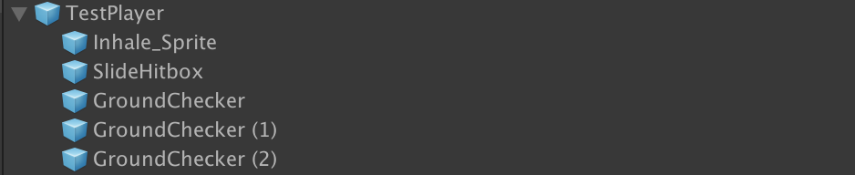
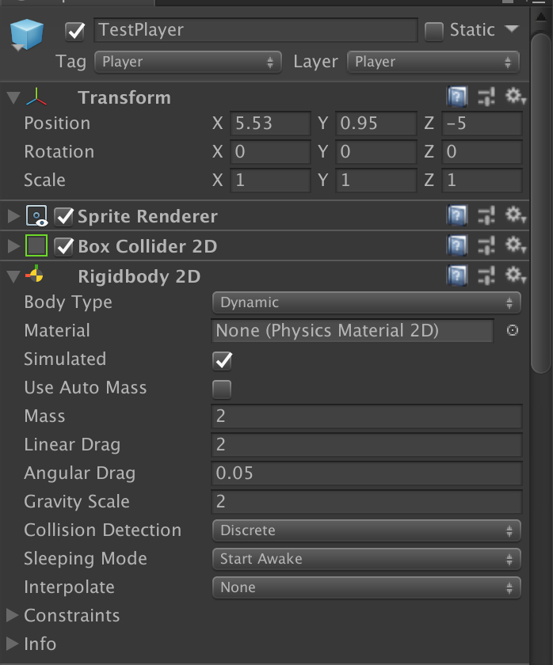
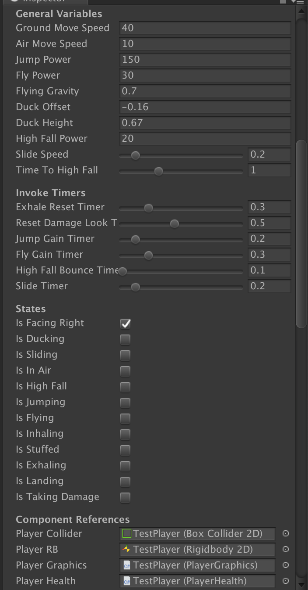
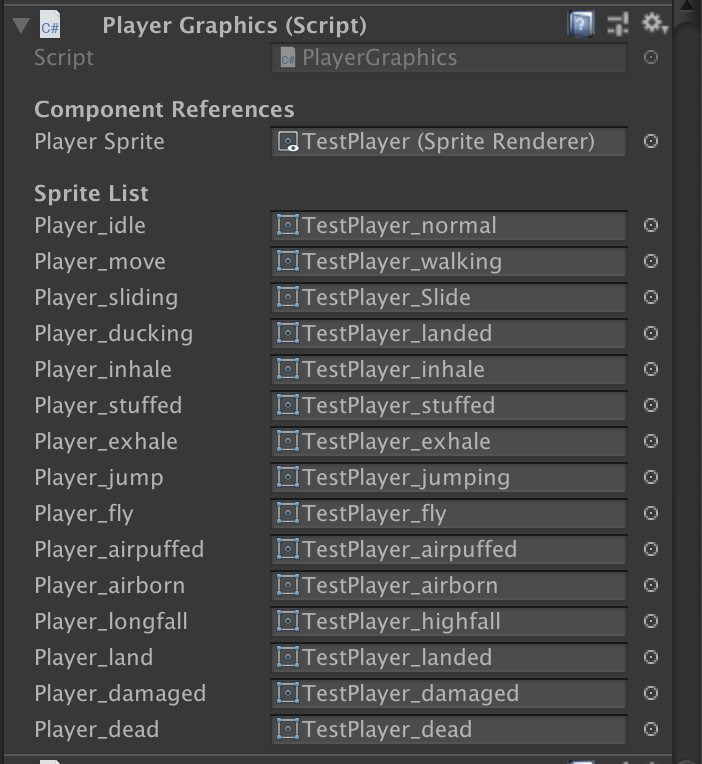
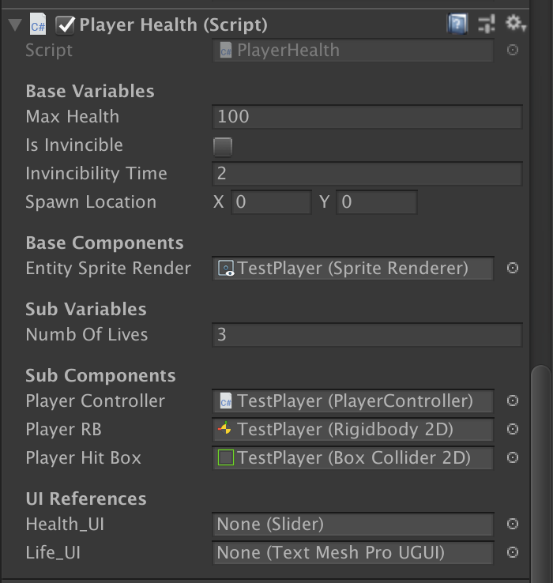

# Player Object Documentation
This documentation explains all of the components that are within the player prefab object.
> For more specific details on the code for each of these components, refer to the comments in the scripts themselves.

## Summary
The player object is the main entity the player controls in the game. As such, the prefab for the player is the most complicated set-piece in the entire prototype.

By convention, the player is tagged `Player` and on the layer `Player`.

This is what the player prefab's children and hierarchy looks like.

- `Inhale_Sprite`: A GameObject that contains the code for inhaling in objects into the player. This is normally deactivated; it is only active when the player is inhaling.
- `SlideHitbox`: A GameObject that acts as the damage point for the player's slide. Like `Inhale_Sprite`, this is only active when the player is sliding.
- `GroundCheckers`: These empty GameObjects act as the reference points in determining if the player has landed on the ground.

## General Components
In total, there are three custom components that they player uses. However, the player still has two components that are shared among all of the other entities in the prototype.
- `Box Collider 2D`
- `Rigidbody 2D`

Each of these are customized accordingly. However, the `Rigidbody 2D` is special in that it has some additional components

- Going into more detail, the player has their `Rigidbody 2D` customized in:
  - Their `Mass`, `Linear Drag` and `Gravity Scale`
  - Their rotation is constrained.

> The values in the `Rigidbody 2D` are set to what they feel the most natural at.

## Custom Components

#### Player Controller

- The `Player Controller` is where all of the main functionality of the player takes place. Hit detection, controls, sprite logic, and state changes all happen in this method.

##### General Variables
- `Ground Move Speed`: How fast the player moves on the ground. Dependent on the Rigidbody's `Mass`
- `Air Move Speed`: How fast does the player move while in the air? This should be lower than the `Ground Move Speed`.
- `Jump Power`: How fast does the player travel upwards when jumping? Also contingent on the Rigidbody's `Mass`.
- `Fly Power`: How fast does the player travel upward while flying? Affected by the Rigidbody's `Mass`.
- `Flying Gravity`: The new gravity to give the player while flying. This should be a smaller value than the gravity that is set already in the Rigidbody's.
- `Duck Offset`: The new y pos of the `Box Collider 2D` when the player is crouching, since crouching decreases the player's size by half.
- `Duck Height`: How tall the player's `Box Collider 2D` is while ducking.
- `High Fall Power`: The amount of damage the player will do when they land on an entity while in `High Fall` mode.
- `Slide Speed`: How fast does the player move while sliding? Works in relation to `Slide Timer`
- `Time to High Fall`: How long does the player need to be in free fall (no jumping or flying) in order to go into `High Fall` mode?

#### Invoke Timers
These variables are used in `Invoke` calls to reset the player's state back to what it was before doing a specific action.
- `Exhale Reset Timer`: How long does it take after exhaling out a projectile or an airpuff before the player can exhale again?
- `Reset Damage Look Timer`: The duration of the player being in hitstun when they take damage.
- `Jump Gain Timer`: How long does the player's jump last? Works in cotangent with `Jump Power`.
- `Fly Gain Timer`: How long does the player's upward movement through flying last? Contingent on `Fly Power`
- `High Fall Bounce Timer`: How long does the player move upward from landing on the ground/bouncing off of an entity when they were in `High Fall` mode?
- `Slide Timer`: How long does the player slide? Works together with `Slide Speed`

#### States
Due to the nature of the prototype, having the player states be a set of booleans is the simplest and quickest way to playtest out the many modes that the player will be in. These states are used not only in determining what sprite the player is using, but it also controls the logic-flow in what actions a player could do at certain times.
- `Is Facing Right`: Keeps track what direction the player is facing. True if the player is facing right, false if facing left.
- `Is Ducking`: Triggered to be true when the player is ducking by holding `S` while on the ground.
  - The player cannot move, jump, or inhale while this is true.
- `Is Sliding`: Set to be true during the time the player is sliding by ducking and pressing `H`
  - The player cannot do any other action while this is true.
- `Is In Air`: True when the player is in the air.
  - The player cannot duck when this is true.
- `Is High Fall`: Turned on when the player has free falled for x seconds.
  - This is only on when the player is in the air.
- `Is Jumping`: Is the player moving upward via a jump?
  - When the vertical gain stops, this boolean is turned off.
- `Is Flying`: Is the player moving upward via flying?
  - This is only on when the player has initiated the fly command while in the air.
- `Is Stuffed`: Did the player inhale an object in?
  - During this state, the player cannot fly, slide or inhale.
  - They can jump, swallow (duck), exhale
- `Is Exhaling`: Is the player exhaling something?
  - A temporary state, mostly used for sprite changes
- `Is Landing`: Did the player just land on the ground?
  - A temporary state, used for sprite changes and logic changes in the code
- `Is Taking Damage`: Is the player in hitstun?
  - Temporary state, the player cannot do anythng during this time.

#### Player Graphics

- This component handles the sprite changes that the player needs to do when they do certain actions.
  - For now, the sprites are handled in a linear, no animation style, since the scope of the prototype is to showcase a mechanic out moreso than art.
  - This directly communicates with the `Player Controller` Component.

#### Player Health

- This component handles keeping track of the player's current health as well as respawning the player. It also is extended from `Base Health` by keeping track of lives and displaying key information onto the screen.
  - `Max Health`: The maximum value the player has on their total amount of health.
  - `Is Invincible`: Is the player immune to taking damage? This automatically gets activated for a brief amount of time when the player takes damage.
  - `Invincibility Time`: How long does the player stay invincible? This ties into a method that gets called when the player takes damage.
  - `Spawn Location`: The reset point the player is placed when they respawn after losing a life. Generally, this is set after each time the player starts a new level as well as goes through a door.
  - `Numb of Lives`: The current amount of lives a player has. When it hits 0, the player is taken to the GameOver screen.
