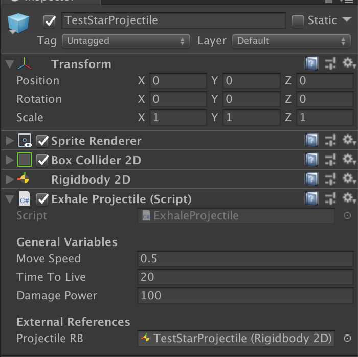
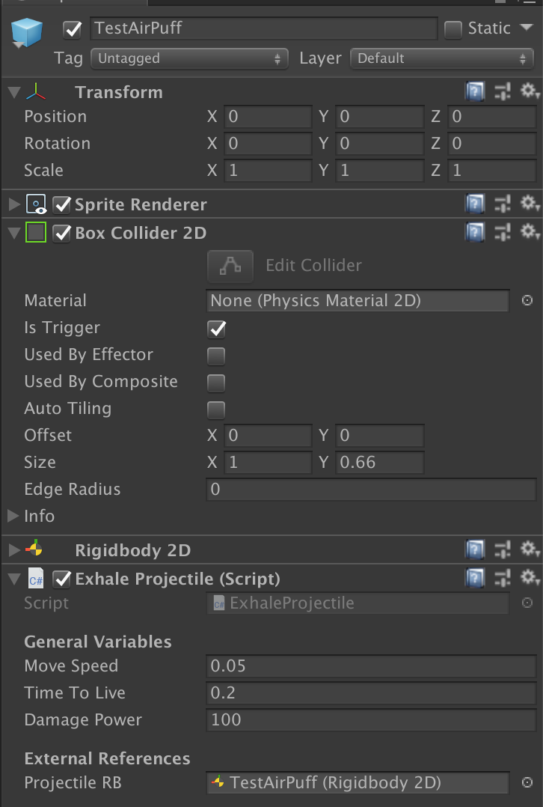

# Projectile Prefabs

This documentation goes over how projectiles work in the prototype.

## Summary
Projectiles all have the following components to them:
- `Sprite Renderer`
- `Box Collider` (that is a trigger)
- `Rigidbody 2D` (that has no gravity)
- `Exhale Projectile` script

### Exhale Projectile Components
This component tells the GameObject that upon creation, move in a linear path for `TimeToLive` seconds. Once it runs into something, it will automatically remove itself.

#### Variables
- `Move Speed`: How fast the projectile will move upon creation.
- `Time To Live`: How long the projectile will last before it destroys itself.
- `Damage Power`: If this projectile hits an entity/block, how much damage will this projectile do?

### Differences Between Projectiles
In order to make different types of projectiles, one needs to only change the following:
- `Sprite Renderer`: sprite to use
- `Box Collider 2D`: size of the hitbox
- `Exhale Projectile`: All three main variables

An example of such differences can be seen with this projectile prefab, different than the first prefab shown:

