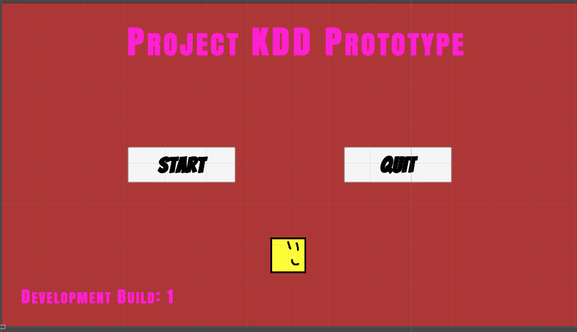
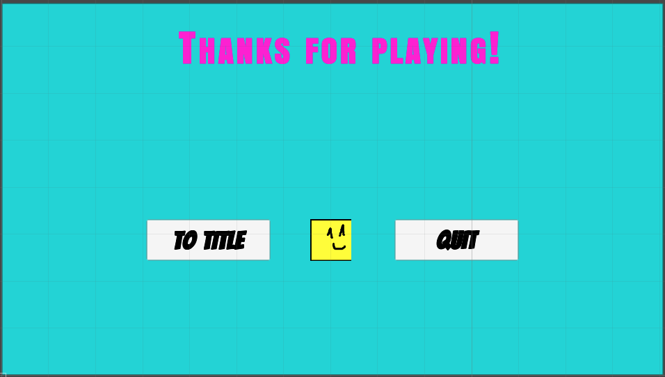
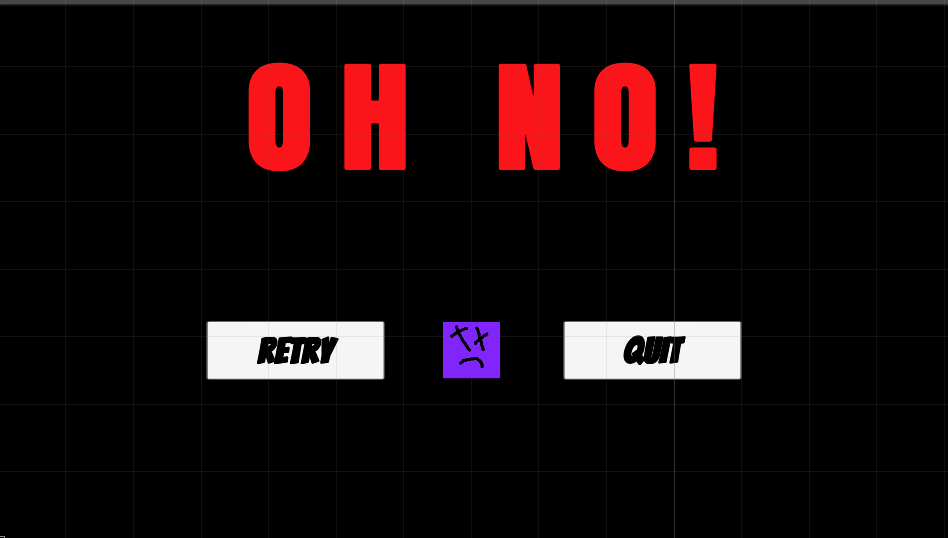

# Screen Documentation
This documentation goes over all of the UI screens that are present in the prototype.

>NOTE: The `Text` that is used in all of these screens is called `TextMesh Pro`, an enhancement of the standard Unity Text UI. This comes with more ways to customize and draw out text for the game.

## Title Screen

- This screen is the first thing the player sees when starting up the prototype. Players can either select `Start` to start playing the prototype, or `Quit` to quit out of the prototype.

Things to note:
- `Development Build: 1` is the number of _official_ builds that are out on this project. Anything that is considered major changes will have a new build number.

## Result Screen

- This screen is shown when the player enters the `GoalDoor` of the prototype level. For now, all it does is asks the player if they want to return to the title screen or to quit the game.In future builds, this screen will be more complicated, potentially having the player select to go to the next level or something.

## Game Over Screen

- This is shown when the player runs out of lives in the game. Hitting `Retry` takes them back to the prototype level from the beginning. In the actual game, `Retry` may take the player back to a world map.
